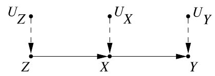

```{r setup, include=FALSE}
knitr::opts_chunk$set(echo = TRUE)
```

<style>
div.footnotes {
  position: absolute;
  bottom: 0;
  margin-bottom: 10px;
  width: 80%;
  font-size: 0.6em;
}
</style>

<script src="https://ajax.googleapis.com/ajax/libs/jquery/3.1.1/jquery.min.js"></script>
<script>
$(document).ready(function() {
  $('slide:not(.backdrop):not(.title-slide)').append('<div class=\"footnotes\">');

  $('footnote').each(function(index) {
    var text  = $(this).html();
    var fnNum = (index+1).toString();
    $(this).html(fnNum.sup());
    var footnote = fnNum + '. ' + text + '<br/>';
    var oldContent = $(this).parents('slide').children('div.footnotes').html();
    var newContent = oldContent + footnote;
    $(this).parents('slide').children('div.footnotes').html(newContent);
  });
});
</script>


## Some admin

> - Push problem sets to GitHub
<!-- will try to get the grades back to you before your next one is due-->
> - Office hours: Tuesdays 2:45pm to 3:45pm, McTavish Rm 33-2
> - Optional Lab 
> - Questions?


## An Alternative Causal Model: Causal Graphs

- The old paradigm: structural equation modeling (SEM) and path analysis
<center>{height=200px}</center>

<div style = "font-size: 12pt">
1. Postulate a causal mechanism and draw a corresponding path diagram
2. Translate it into a (typically linear) system of equations:
$$  Y =  \alpha_0 + \alpha_1 X + \alpha_2 Z + \epsilon_\alpha \\
    X = \beta_0 + \beta_1 Z + \beta_2 W + \beta_3 V + \epsilon_\beta \quad \cdots $$
3. Estimate $\beta$, $\alpha$, etc. typically assuming normality and exogeneity
</div>

- However: Strong distributional/functional form assumptions and no language to distinguish causation from association

## Pearl's Attack

<div class="columns-2">
  {height=500px}

- Judea Pearl (1936–) proposed a new causal inference framework based on <span class="red">nonparametric structural equation modeling (NPSEM) </span>
- Computer scientist, working on Artificial Intelligence
- <i>Causality</i> (2000, Cambridge UP)
- Pearl’s framework builds on SEMs and revives it as a formal language of causality.
</div>


## Anatomy of a Causal Directed Acyclic Graph (DAG)

> - Composed of nodes ($\bullet$ = observed or $\circ$ = unobserved variables) and directed edges ($\longrightarrow$ = possible causal relationship).
> - Exogenous variables that are not explicitly modelled can be omitted from a graph
> - It is *missing edges* that encode causal assumptions: missing arrows encode exclusion restrictions

<center>
{height=200px}

{height=200px}
</center>

- The corresponding structural equations:
<center> $z = f_z(u_z)$,  $x = f_x(z, u_x)$, and $y = f_y(x, u_y)$  </center>

<!-- ##  -->

<!-- How do we get from: -->

<!-- <center> -->
<!-- {height=200px} -->
<!-- </center> -->

<!-- to: -->
<!-- <center> -->
<!-- {height=200px} -->
<!-- </center> -->

## `do()` Operator and Causal Effects
- Treatments (interventions) are represented by the $do()$ operator

- For example, $do(x_0)$ holds $X$ at $x_0$ exogenously ($x = x_0$)

- The pre-intervention distribution: $P(x, y, z)$

- The post-intervention distribution: $P(y, z \mid do(x_0))$
<center>
{height=100px}
</center>

- Then, the ATE is defined as $\mathbb{E}[Y\mid do(x_1)] - \mathbb{E}[Y\mid do(x_0)]$

- Identification: Can $P(y\mid do(x))$ be estimated from data governed by the pre-intervention distribution $P(x,y,z)$?

<!-- $\mathbb{E}[Y\mid X=x_0] = \mathbb{E}[f_Y(x,u_Y)\mid X=x_0] \ = \mathbb{E}[f_Y(x_0, u_Y)]  = \ \mathbb{E}[Y\mid do(x_0)]$ -->

## Why DAGs?

- Fundamental equivalence of causal graphs and potential outcomes:

<center> $z = f_z(u_z)$,  $x = f_x(z, u_x)$, and $y = f_y(x, u_y)$  </center>

<center style = "font-size: 30pt"> = </center>

<center> $Z_i$,  $X_{Zi}$, and $Y_{Xi}$  </center>

<br>

- Potential outcomes framework (Neyman-Rubin model) is the dominant framework for causal inference in the social sciences.


## Why DAGs?

- DAGs are a great way of encoding your causal assumptions. 
- I.e. Party id as the "unmoved-mover" (e.g., Campbell et al., 1966; Green and Palmquist, 1994; Miller and Shanks, 1996; Green et al., 2004)?
- OR can short-term factors like issue positions <footnote>Carsey and Layman, 2006; Highton and Kam, 2011 </footnote>, candidate characteristics <footnote>Page and Jones, 1979</footnote>, and economic perceptions <footnote>Fiorina, 1981; MacKuen et al., 1989</footnote>, at least under some conditions, move party id?

- <center>
{height=300px}

 </center>


## Estimand, Estimators, and Estimates

What are these?

> - $$Y = \beta_0 + \beta_1X_1 + u$$

> - $$Y = \hat{\beta_0} + \hat{\beta_1} X_1 + \hat{u} $$

 - <div class="blue"> $$\hat{\beta} = (X^{\prime}X)^{-1}X^{\prime}y$$ </div>

## Estimand, Estimators, and Estimates

<div style="float: left; width: 20%;"> 

```{r echo = FALSE, warning=FALSE, fig.align = "left"}
library(DiagrammeR)
grViz("digraph flowchart {
      # node definitions with substituted label text
      node [fontname = Helvetica, shape = rectangle]        
      tab1 [label = '@@1']
      tab2 [label = '@@2']
      tab3 [label = '@@3']

      # edge definitions with the node IDs
      tab1 -> tab2 -> tab3;
      }

      [1]: 'Estimand'
      [2]: 'Estimator'
      [3]: 'Estimate'
      ")
```

</div>

<div style="float: right; width: 55%; font-size: 17pt"> 

- $\theta$: An unknown value that describes a population relationship. The concept we want to estimate.

- <div class = "blue">$ATE = \mathbb{E}[Y_{1i} - Y_{0i}]$</div>

- $\widehat{\theta}(Y)$: A rule (i.e., function) for combining data to produce a numerical value for a population parameter (estimand); 

- <div class = "blue">$\widehat{ATE} =  \frac{1}{n_1}\sum_{i=1}^n D_iY_i - \frac{1}{n_0}\sum_{i=1}^n (1-D_i)Y_i$</div>

- $\widehat{\theta}(Y=y)$: The numerical value(s) taken on by an estimator for a particular sample of data.
  
</div>

## Estimation and Sampling Distribution

- Estimators produce estimates. Under repeated random sampling, they produce many estimates.

- Assuming repeated random sampling, we can calculate the uncertainty around our point estimates.

- Under repeated sampling, we also have a distribution of an estimate: a sampling distribution (the probability distribution of a statistic).

## Sampling Distribution of the Mean

- 
<table id="t01"; style="width:80%; height:50%; border:1px solid black;margin-left:auto;margin-right:auto;">
 <thead>
  <tr>
   <td style="text-align:center;"> <strong>Estimand</strong>  </th>
   <td style="text-align:center;"> <strong>Estimator</strong> </td>
   <td style="text-align:center;"> <strong>Sampling Distribution</strong> </td>
  </tr>
 </thead>
<tbody>
  <tr>
   <td style="text-align:center;"> <strong>$\mathbb{E}(X) = \mu$ </strong></td>
   <td style="text-align:center"> $\bar{X}_n = \frac{1}{n}\sum_{i=1}^n X_i$ </td>
   <td style="text-align:center"> $\bar{X}_n \sim \mathcal{N}(\mu,\frac{\sigma^2}{n})$ </td>
  </tr>
</tbody>
</table>

<!--Create vector X of 1000 observations drawn from a Bernoulli distribution. Our Bernoulli distribution (the binomial with n = 1), which happens to have p = 0.5.-->
```{r}
set.seed(01102020)
X <- rbinom(1000, 1, 0.5)

mean.estimator = function(X) {
  # Calculate the size of the sample, n.
  n <- length(X)
  # Apply the estimator to the sample data.
  mu.hat <- (1/n) * sum(X)
  return(mu.hat)
}

# Estimate mean
mean.estimator(X)
```

## This is the sampling distribution of our estimator.
```{r echo = FALSE}
library(ggplot2)
```

```{r}
mu_samp <- replicate(10000, mean.estimator(rbinom(1000, 1, 0.5)))
```

```{r echo = FALSE, fig.width=5, fig.height=4, fig.align="center", message = FALSE}
ggplot() + 
  geom_histogram(aes(mu_samp, y = ..density..), alpha = 0.7) +
  geom_density(aes(mu_samp)) + 
  geom_vline(xintercept = 0.491, lty = 2, col = "red") +
  labs(x = "Estimates", y = "Density") + theme_classic()
```


## Law of Large Numbers and Central Limit Theorem

- Law of Large Numbers: If $X_1,...,X_n$ are drawn independently from the distribution of $X$ (randomly sampled), then the sample average converges in probability to the population average of $X$ <footnote>$\bar{X_n} \overset{p}{\to} \mathbb{E}[X]$ as $n \to \infty$, assuming the expected value exists $\mathbb{E}[X] < \infty$</footnote>

-
```{r echo = FALSE, warning = FALSE, fig.width=5, fig.height=4, fig.align="center"}
die <- 1:6
roll <- function(n) {
  mean(sample(die, size = n, replace = TRUE))
}

rolls <- sapply(1:10000, roll)

ggplot() +
  geom_line(aes(x = 1:10000, y = rolls)) +
  geom_hline(yintercept = 3.5, col = "red") +
  ylim(limits = c(0, 6)) +
  labs(x =  "Number of dice rolls", y = "Mean") +
  theme_classic()
```

----

- Central Limit Theorem: The sampling distribution of the sample means approaches a Normal distribution as the sample size increases (no matter what the underlying population distribution is). <footnote>If $X_1,...,X_N$ are drawn independently drawn from the distribution of $X$, and $\mathbb{V}[X] < \infty$ then, the difference between the sample average of $X$ and the population average of $X$ (scaled by $\sqrt{N}$) converges in distribution to a Normal distribution. That is, $\sqrt{N}(\bar{X}_N - \mathbb{E}[X]) \overset{D}{\to} \mathcal{N}(0, \sigma^2)$</footnote> 

- 
```{r echo = FALSE, message = FALSE,  fig.width=5, fig.height=3.5, fig.align="center"}
samp_mean1 <- samp_mean5 <- samp_mean30 <- samp_mean100 <- rep(0, 10000)

for (i in 1:10000) {
  samp_mean1[i] <- mean(rpois(1, 1.5))
  samp_mean5[i] <- mean(rpois(5, 1.5))
  samp_mean30[i] <- mean(rpois(30, 1.5))
  samp_mean100[i] <- mean(rpois(100, 1.5))
}

gridExtra::grid.arrange(qplot(samp_mean1) + theme_bw(), 
                        qplot(samp_mean5) + theme_bw(),
                        qplot(samp_mean30) + theme_bw(),
                        qplot(samp_mean100) + theme_bw())

```


## (Desirable) Properties of Estimators

- Unbiasedness $$\mathbb{E}[\hat{\mu}] = \mu$$
<!-- unbiasedness of an estimator is a property of repeated samples! -->
- (Relative) Efficiency $$\mathbb{V}[\hat{\mu_1}] < \mathbb{V}[\hat{\mu_2}]$$
- Consistency $$\hat{\mu} \overset{p}{\to} \mu$$
- Asymptotic Normality $$\hat{\mu} \overset{approx.}{\sim} \mathcal{N}\Big(\mu, \frac{\sigma^2}{n}\Big)$$

## Review of potential outcomes

- $D_i$: Indicator of treatment intake for unit $i$, where $i = 1, ..., N$; for now, $D_i \in \{0,1\}$.

- $Y_i$: Variable of interest, whose value is observed, which may be affected by the treatment.

## Quiz yourself!

Are the following equalities always true? 

> - $Y_{di} = Y_{i}(d)$ 

- <div class="blue"> Yes. </div>

> - $\mathbb{E}[Y_{i}(0)|D_i = 1] = \mathbb{E}[Y_{i}(0)|D_i = 0]$

- <div class="blue"> Nope. </div>
  
> - $Y_{i}(d_i) = Y_{i}(d_i, d_{i-1}, d_{i+1})$

- <div class="blue"> Nope. </div>
 <!-- SUTVA -->

> - $\mathbb{E}[Y_i(1) - Y_i(0)] = Y_i(1) - Y_i(0)$
 <!-- unit vs. average effects -->
 
- <div class="blue"> Nope again. </div> 

## Review of potential outcomes

Which of these are observed?

<table id="t01"; style="width:80%; height:50%; border:1px solid black;margin-left:auto;margin-right:auto;">
 <thead>
  <tr>
   <td style="text-align:center;">   </td>
   <td style="text-align:center;"> <strong>$Y = 1$</strong> </td>
   <td style="text-align:center;"> <strong>$Y = 0$</strong> </td>
  </tr>
 </thead>
<tbody>
  <tr>
   <td style="text-align:center;"> <strong>$D = 1$ </strong></td>
   <td style="text-align:center"> $\mathbb{E}[Y_i(1)|D_i = 1]$ </td>
   <td style="text-align:center"> $\mathbb{E}[Y_i(0)|D_i = 1]$ </td>
  </tr>
  <tr>
   <td style="text-align:center;"> <strong>$D = 0$</strong> </td>
   <td style="text-align:center"> $\mathbb{E}[Y_i(1)|D_i = 0]$ </td>
   <td style="text-align:center;"> $\mathbb{E}[Y_i(0)|D_i = 0]$ </td>
  </tr>
</tbody>
</table>

## Review of potential outcomes

Which of these are observed?

<table id="t01"; style="width:80%; height:50%; border:1px solid black;margin-left:auto;margin-right:auto;">
 <thead>
  <tr>
   <td style="text-align:center;">   </th>
   <td style="text-align:center;"> <strong>$Y = 1$</strong> </td>
   <td style="text-align:center;"> <strong>$Y = 0$</strong> </td>
  </tr>
 </thead>
<tbody>
  <tr>
   <td style="text-align:center;"> <strong>$D = 1$ </strong></td>
   <td style="text-align:center"> $\mathbb{E}[Y_i(1)|D_i = 1]$ </td>
   <td style="text-align:center; color:red"> $\mathbb{E}[Y_i(0)|D_i = 1]$ </td>
  </tr>
  <tr>
   <td style="text-align:center;"> <strong>$D = 0$</strong> </td>
   <td style="text-align:center; color:red"> $\mathbb{E}[Y_i(1)|D_i = 0]$ </td>
   <td style="text-align:center;"> $\mathbb{E}[Y_i(0)|D_i = 0]$ </td>
  </tr>
</tbody>
</table>

<br>

- This problem has a name... 
<br>
- <div class="red">The Fundamental Problem of Causal Inference!</div>

- Can't we just use this naive estimator? $\mathbb{E}[Y_i|D_i = 1] - \mathbb{E}[Y_i|D_i = 0]$
- <div class="blue">It depends.</div>

## Selection Bias

> - Data from National Health Interview Survey (NHIS) 2005. Health
status measured from 1 (poor health) to 5 (excellent health).

<table id="t01"; style="width:80%; height:50%; border:1px solid black;margin-left:auto;margin-right:auto;">
 <thead>
  <tr>
   <td style="text-align:center;"> <strong> Group </strong></th>
   <td style="text-align:center;"> <strong>Sample Size</strong> </td>
   <td style="text-align:center;"> <strong>Avg Health Status</strong> </td><td style="text-align:center;"> <strong>Std Error</strong> </td>
  </tr>
 </thead>
<tbody>
  <tr>
   <td style="text-align:center;"> Hospital</td>
   <td style="text-align:center"> 7,774</td>
   <td style="text-align:center"> 3.21 </td>
   <td style="text-align:center"> 0.014 </td>
  </tr>
  <tr>
   <td style="text-align:center;">No Hospital</td>
   <td style="text-align:center"> 90,049</td>
   <td style="text-align:center"> 3.93 </td>
   <td style="text-align:center"> 0.003 </td>
  </tr>
</tbody>
</table>
<br>

- <span class="blue">Going to the hospital makes people sick!? O_o </span>

## GitHub markdown 

