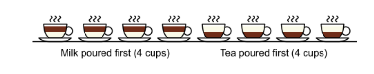

```{r setup, include=FALSE}
knitr::opts_chunk$set(echo = TRUE)
```


<style>
div.footnotes {
  position: absolute;
  bottom: 0;
  margin-bottom: 10px;
  width: 80%;
  font-size: 0.6em;
}

pre {
  font-size: 22px;
}

</style>

<script src="https://ajax.googleapis.com/ajax/libs/jquery/3.1.1/jquery.min.js"></script>
<script>

$(document).ready(function() {
  $('slide:not(.backdrop):not(.title-slide)').append('<div class=\"footnotes\">');

  $('footnote').each(function(index) {
    var text  = $(this).html();
    var fnNum = (index+1).toString();
    $(this).html(fnNum.sup());
    var footnote = fnNum + '. ' + text + '<br/>';
    var oldContent = $(this).parents('slide').children('div.footnotes').html();
    var newContent = oldContent + footnote;
    $(this).parents('slide').children('div.footnotes').html(newContent);
  });
});
</script>

## Problem Set 1

- Common issues 

- OHs: Tuesdays 2:45pm - 3:45pm if you have a specific question about your assignment

## Randomization Inference

<blockquote>" A lady declares that by tasting a cup of tea made with milk she can discriminate whether the milk or the tea infusion was first added to the cup. We will consider the problem of designing an experiment by means of which this assertion can be tested. […] [It] consists in mixing eight cups of tea, four in one way and four in the other, and presenting them to the subject for judgment in a random order. The subject has been told in advance of that the test will consist, namely, that she will be asked to taste eight cups, that these shall be four of each kind […]. " — Fisher, 1935.</blockquote>

{height=150px}

## Hypothesis Testing in Randomization Inference

- Another way of assessing the uncertainty around the $\widehat{ATE}$ of our sample?

<!-- Also known as Permutation Tests for reasons that will become obvious in a bit.-->

<!-- Q: Where does the uncertainty come from? Compare this to model-based inference...In RI, POs are fixed not random variables. -->

- Define the <span class="blue"> sharp </span> null hypothesis as: $$H_0: Y_i(1) - Y_i(0) = 0$$ for all units $i$.
<!-- In other words, when there is no individual-level effect. -->

- Note that this is "stronger" than: $$\mathbb{E}[Y_i(1) - Y_i(0)] = 0$$ 

- <div class="red"> What's the difference? Why is the first a stronger statement than the second? </div>
<!-- What does the first say (individual potential outcomes), what does the second say? -->

## Hypothesis testing in Randomization Inference

- Under the null ($H_0: Y_i(1) = Y_i(0)$), we can construct an *exact* <footnote> *Exact if all possible random assignments are simulated. The number of permutations can blow up quickly, in which case, it is not practical to simulate them all. See additional notes.*</footnote> sampling distribution for the sample ATE.

- <span class = "blue">How?</span> Assuming <span font-size:14px>$Y_i(1) = Y_i(0)$</span> means that we observe *both* potential outcomes for unit $i$! This allows us to simulate all possible randomizations with the full set of potential outcomes.

- Then, we ask: "If this null were true, how likely am I to get the estimate that I actually obtained?"

```{r}
browseURL("https://www.jwilber.me/permutationtest")
```

## A simple example with some code

Suppose we have a vector of observed outcomes from an experiment with 9 observations where 5 the units were treated.

```{r}
# Treatment assignment vector
d <- c(0,1,1,1,0,1,0,0,1)

# Observed outcomes
Y <- c(2,1,3,4,2,3,0,4,6)

# compute the sample ATE
obs.sate <- mean(Y[which(d==1)]) - mean(Y[which(d==0)])
obs.sate
```

- Exercise: generate all possible random assignments (permutations) for the 9 units, and choose only the arrangements where 5 units are treated.

---- 

Create matrix of all possible treatment assignments for all 9 units.

```{r}
# number of units
n <- 9

# units can either be given treatment or not
D <- c(0,1) 

# permute treatment assignments
all_permute_treatment <- expand.grid(rep(list(D), n))

head(all_permute_treatment)
```

----

```{r}
# selecting only the rows where the number of treated is equal to 5
all_permute_treatment <- all_permute_treatment[rowSums(all_permute_treatment) == 5, ]

head(all_permute_treatment, n = 10)
```
.
.
.


## Number of Combinations

- For N observations, where *n*<sub>t</sub> denotes the number of observations in the treated group, *n*<sub>c</sub> is number of observations in the control group, and *n*<sub>t</sub> + *n*<sub>c</sub> = N, the permutation of assignments is: 
$${N\choose n_t} = \frac{N!}{n_t!(N-n_t)!}= \frac{N!}{n_t! n_c!}$$ 


## Number of Combinations

- Our example: N = 9, treated = 5, control = 4
```{r}
factorial(9)/(factorial(5)*factorial(4))
# same as nrow(all_permute_treatment)
```


- What if *N* = 50? In the case where the number of possible randomizations is too large and we cannot obtain an exact distribution, we can rely on Monte Carlo approximation.

----

> - Now, we want to simulate a distribution of a test statistic under the sharp null.

> - Exercise: For each row, calculate the difference in means and plot the estimates.


----

> -  For each permutation, estimate the ATE.<footnote> We can always replace this with another quantity of interest (i.e. rank sum statistic). This is part of the appeal of RI! </footnote>

```{r}
permute.sate <- c(length(all_permute_treatment))

for(i in 1:nrow(all_permute_treatment)){
  D_star <- unlist(all_permute_treatment[i,])
  permute.sate[i] <- mean(Y[which(D_star==1)]) - mean(Y[which(D_star==0)])
}
```


----

```{r}
# quantile(permute.sate, c(0.025, 0.975))
```

```{r message = FALSE, fig.width=4, fig.height=3, fig.align="center"}
# this is our sampling distribution!
library(ggplot2)
qplot(permute.sate) +
  labs(x = "Simulated Effect Size", y = "Count") +
  geom_vline(xintercept = obs.sate, lty =2, col = "red", lwd = 2) +
  theme_bw()
```

----

- Let's count how many of the simulated values are as large (in magnitude) as the observed $\widehat{ATE}$. 

```{r}
# This is a two sided test
t_star <- length(permute.sate[which(abs(permute.sate) >= abs(obs.sate))])
```
<!-- Q: how would we calculate a one-tailed test?-->

- Then, divide by the number of combinations to get the <span class="red"> [???] </span>. What did we just compute? <footnote>It's just a counting problem: $$p = \frac{1}{K}\sum_{k=1}^K \mathcal{I} (|\hat{T_k}| \geq |T|)$$ where K is the total number of combinations, and T is the test statistic. $\mathcal{I}(\cdot)$ is the indicator function. </footnote> 

```{r}
t_star/nrow(all_permute_treatment)
```

- <span class="red"> How do we interpret this value? </span>
- <span class="red"> How does this differ from a t-test?</span>


## Summary of RI Procedure
1. Define the sharp null and choose a test statistic.
2. Calculate observed test statistic.
3. Permute vectors of different possible randomization assignments.
4. Compute the test statistic for these simulations.
5. Find the p-value. 


----

All this can be done easily with the `ri2` package!

- Key functions: `declare_ra()` and `conduct_ri()`
- Can also specify different designs (clustered, blocking).

```{r message = FALSE}
library(ri2)

# using the same toy example...
dat_table <- data.frame(Z = d, Y = Y)

# "declare" your randomization procedure: we have 9 observations, 5 of which are treated
declaration <- declare_ra(N = 9, m = 5)

# Conduct Randomization Inference
ri <- conduct_ri(
  formula = Y ~ Z,
  declaration = declaration,
  sharp_hypothesis = 0,
  data = dat_table
  # sims = 100
)
```

----

Look familiar?
```{r, fig.width=5, fig.height=4, fig.align="center"}
summary(ri)

plot(ri)
```


## Summary of RI Procedure

> - ADVANTAGES
- No distributional assumptions. <span class = "blue"> Under what conditions would this be beneficial?</span> 
- Works for any test-statistic

> - DISADVANTAGES
- The sharp null is often uninteresting (how often is a causal effect exactly zero for every single unit?)
- For large N, still relying on asymptotics.

<!-- ## Inverting Hypothesis Testing to Construct CIs -->

<!--  -->
<!-- - We "invert" the test... -->
<!-- - assume additive constant effects... -->
<!-- - Slight change to the sharp null to be: $$Y_i(1) =  Y_i(0) + \tau$$ for all units.  -->

## Clustered Data and Cluster Randomization

> - It's not always possible to assign treatment at the unit level is impossible. Instead, we assign treatment to clusters of units.

- Suppose we have units *i* where *i* &isin; \{1, ..., *N*\}, which are grouped in clusters *j* for *j* &isin; \{1, ..., *M*\}.

- Each cluster is equally sized, such that there are $\frac{N}{M}$ units in each.

- Here: *N* = 1000 units, *M* = 50 clusters, and cluster size is *1000/50 = 20*

## Simulating Clustered Data

- Randomly assign half the clusters ($\frac{M}{2}$) to treatment. 

- Induce intracluster correlation by creating a common mean for each cluster (`mu_j0`), so that the POs for each unit is correlated with those of other units in the same cluster: $$Y_{ij}(0) \sim \mathcal{N}(\mu_{j0}, 1)$$
$$Y_{ij}(1) \sim \mathcal{N}(\mu_{j1}, 1)$$
where $$\mu_{j0} \sim \mathcal{U}(0, 10)$$ and $$\mu_{j1} \sim \mathcal{U}(6, 16)$$

## Simulating Clustered Data

```{r}
N <- 1000
M <- 50

# Begin by creating a cluster indicator
J <- rep(c(1:M), each = 20)

# Draw group-level means for each cluster
mu_j0 <- runif(M, 0, 10)
mu_j1 <- runif(M, 6, 16)

# Calculate new values (potential outcomes under control and treatment) with clustered data
Y0 <- rnorm(N, mean = rep(mu_j0, each = 20), sd = 1)
Y1 <- rnorm(N, mean = rep(mu_j1, each = 20), sd = 1)
```

## Simulating Clustered Data

> - TRY TO DO THE FOLLOWING: 
1) randomly select half of the clusters into treatment, 
2) create a vector of 0s and 1s representing treatment assignment,
3) calculate the realized outcome <span class = "blue"> What's the formula again?</span>
4) get the ATE, $\mathbb{E}[Y_{ij}| D_{ij} = 1] - \mathbb{E}[Y_{ij}| D_{ij} = 0]$, using the difference in means estimator

## Clustered Data and Cluster Randomization

1. randomly select half of the clusters into treatment
```{r}
# randomly pick 25 of the 50 clusters to be assigned to treatment
D <- sample(unique(J), length(unique(J))/2)
D_j <- rep(0, length(unique(J)))
```


2. create a vector of 0s and 1s representing treatment assignment
```{r}
# find the randomly chosen clusters and assign them to treatment (D = 1)
D_j[which(unique(J) %in% D)] <- 1
D_ij <- rep(D_j, each = length(J)/length(unique(J)))
```

## Clustered Data and Cluster Randomization

3. $\text{compute the realized outcome for each unit } i \text{ in cluster } j: Y = [Y_1\times D] + [Y_0 \times (1 - D)]$
```{r}
# calculate the realized outcome Y
Y_ij <- Y1*D_ij + Y0*(1-D_ij) 

clustered_data <- data.frame(outcome = Y_ij, treated = D_ij, clusterid = J)
head(clustered_data)
```


## Clustered Data and Cluster Randomization

- Calculate the difference in means
```{r}
mean(clustered_data$outcome[clustered_data$treated == 1]) - mean(clustered_data$outcome[clustered_data$treated == 0])

# or t.test, or bivariate OLS, whatever floats your boat
#t.test(clustered_data$outcome[clustered_data$treated == 1], clustered_data$outcome[clustered_data$treated == 0])
```

## Clustered Data and Cluster Randomization

```{r echo = FALSE}
simFun_cluster <- function(m, n = 1000){
  # create a 100-vector that indexes j in 1:M
    j=cut(1:n, m, labels=FALSE)
    # for 1:M, assign half the clusters to treatment; create a treatment
    # indicator by comparison of j to the result of the assignment
    d=j %in% sample(1:m, m/2)
    # draw group means from the uniform
    mu.0j=runif(m, 0, 10)
    mu.1j=runif(m, 6, 16)
    # draw values of y_di with mean \mu_dj
    y0=rnorm(n = n, mean = mu.0j[j], sd =1)
    y1=rnorm(n = n, mean = mu.1j[j], sd = 1)
    # realize potential outcomes by treatment status
    y= y1*d + (1-d)*y0
    # with clusters of equal size, the difference in cluster means is the
    # mean difference over units; just take that
    mean(y[d]) - mean(y[!d])
}
#simFun_cluster(m = 50)
```

- If we repeat the process 1,000 times (use `replicate()`), we get a distribution of simulated treatment effects.

```{r echo = FALSE, message = FALSE, fig.width=4, fig.height = 3, fig.align="center"}
sim_50 <- replicate(1000, simFun_cluster(m = 50))
qplot(sim_50) + xlab("Effect Size")
```

- remember to `set.seed` for replicability!
- Experiment with different cluster sizes, sample sizes, and number of clusters. How do these factors change the variability of the simulated distribution?

```{r echo = FALSE, message = FALSE, eval = FALSE}
sim_100 <- replicate(1000, simFun_cluster(m = 100))
sim_10 <- replicate(1000, simFun_cluster(m = 10))

ggplot() +
  geom_density(aes(sim_10), col = "red") +
  geom_density(aes(sim_50), col = "blue") +
  geom_density(aes(sim_100)) +
  theme_bw()
```

## Clustered Data and Cluster Randomization

- if `var_within` is small (implying similarity between units in a cluster), then *&rho;* (ICC) <footnote>$ICC = \rho = \frac{\sigma^2_{B}}{\sigma^2_{W} + \sigma^2_{B}}$ where $\sigma_B^2$ is between-cluster variance and the denominator is the total variance.</footnote> is large (*&rho;* &rarr; 1) and the design effect (ratio between variance under clustered vs. complete randomization)<footnote>More precisely, is the variance of the estimator when the effect of clustering is taken into account over the variance of the estimator under the hypothesis of a simple random sample: $$\frac{\mathbb{V}_{clu}(\beta)}{\mathbb{V}_{ols}(\beta)} = 1 + (N - 1)\rho$$</footnote> is also large. 

- The variance under cluster randomization is much greater than that under complete (individual) random assignment. Put differently, the efficiency penalty increases as unit outcomes within a cluster become more similar. 

- Intuitively, when random assignment is done at the cluster level, greater similarity between observations within clusters means that we have "less information" (i.e. loss of statistical power) and the effective sample size diminishes.

- see Angrist and Phischke (p. 323) for derivation of Moulton Factor/Design Effect from a model-based approach (as opposed to experimental design, but intuition is similar).


